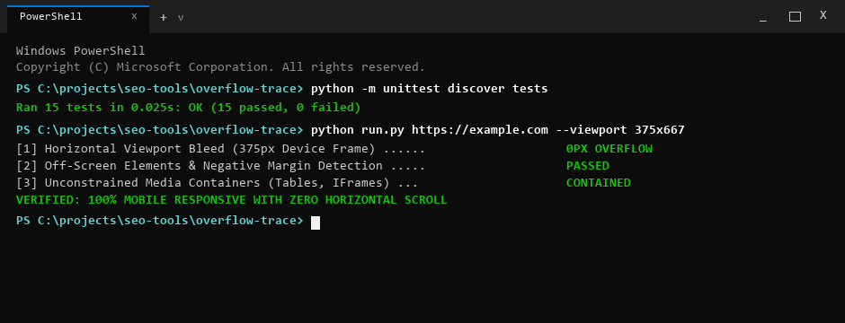

# OverflowTrace

> [!NOTE]
> **Public Architecture & Distribution Notice**: This repository provides the open-source CLI interface, demonstration fixtures, and automated test suite. Full-scale headless browser automation, real-time CDP continuous profiling, and automated white-label client PDF reporting are exclusively hosted on the [WebAudits.pro](https://www.webaudits.pro) cloud platform.


Supporting web-performance & viewport geometry diagnostic tool. Traces mobile horizontal viewport overflow and layout spill.

Part of the [WebAudits.pro](https://webaudits.pro) technical intelligence ecosystem.



---

## Quickstart

Install in editable mode and audit mobile horizontal overflow in seconds:

```bash
# Clone and install
git clone https://github.com/xcalibur73/overflow-trace.git
cd overflow-trace
pip install -r requirements.txt
pip install -e .

# Audit target URL with default mobile viewport (iPhone SE 375px)
overflow-trace https://example.com

# Audit using compact 320px screen
overflow-trace https://example.com --viewport 320x568
```

---

## What It Does & Why It Matters

OverflowTrace emulates mobile screen dimensions using headless Chromium via Chrome DevTools Protocol (CDP) to detect and isolate horizontal layout spills.

Horizontal layout overflow is one of the most common mobile user experience failures:
- It causes unintentional horizontal panning, breaks sticky navigation bars, and introduces mobile touch friction.
- Search engine crawlers evaluate responsive usability as a core mobile experience signal.
- Responsive developer tools often obscure subtle 1px to 10px overflows caused by margins or viewport units (`100vw`).

OverflowTrace isolates the exact offending DOM node selector and synthesizes drop-in CSS fixes:
- **CDP Device Emulation:** Emulates mobile devices with accurate screen width, height, device scale factor, and touch support.
- **Offending Node Isolation:** Evaluates in-browser geometry via `getBoundingClientRect()` to rank offending elements by spill severity.
- **Rogue Container Root Cause Diagnosis:** Identifies fixed-width containers, unconstrained `<pre>` or `<table>` tags, and improper viewport unit usage.
- **Drop-in CSS Remediation:** Generates tailored CSS recipes (such as `overflow-x: clip` and `min-width: 0`) for each identified culprit.

---

## Usage & CLI Options

```bash
# Audit with default iPhone SE mobile viewport (375x667)
overflow-trace https://webaudits.pro

# Audit using iPhone 14/15 preset (390x844)
overflow-trace https://example.com --device iphone-14

# Audit using compact narrow viewport (320x568)
overflow-trace https://example.com --viewport 320x568

# Export machine-readable JSON for CI/CD visual regression checks
overflow-trace https://example.com --output json --save overflow-audit.json

# Check installed version
overflow-trace --version
```

---

## Example Output

```text
+-------------------------------------------------------------------------------+
| OverflowTrace: Mobile Viewport Horizontal Overflow Diagnostic                 |
| Target URL: https://webaudits.pro                                             |
| Layout Stability Verdict: CLEAN_RESPONSIVE (Zero Overflow Detected)           |
| Device: iPhone SE (375x667) | Viewport Width: 375px | ScrollWidth: 375px       |
+-------------------------------------------------------------------------------+

Viewport Spill Telemetry:
- Horizontal Overflow: 0px (PASS)
- Offending Nodes Found: 0
- Maximum Spill Width: 0px

Responsive Layout Verdict: Clean layout settlement across mobile viewport.
```

---

## Architecture

```text
[Target URL + Device Preset]
            |
            v
   [Chromium CDP Engine]
            |
            +---> Device Metrics Emulation (Width, Scale Factor, Touch)
            |
            +---> Network Idle Navigation & Layout Stabilization
            |
            v
[DOM Evaluation Script]
            |
            +---> Visual Viewport Bounds vs. ScrollWidth
            +---> Offending Node getBoundingClientRect() Scan
            +---> Root Cause Heuristics (100vw, flex, fixed px)
            |
            v
[Remediation Generator]
            |
            +---> Terminal CLI Report
            +---> Markdown Document / JSON Pipeline Output
```

- `devices.py`: Manages mobile device specifications (iPhone SE, iPhone 14/15, compact 320px screen, custom dimensions).
- `browser.py`: Coordinates headless Chromium via CDP, applying device metrics and running the inspection script after a stabilization buffer.
- `inspector.py`: Runs a client-side JavaScript routine that queries DOM nodes, compares right edges against `window.innerWidth`, and identifies parent container constraints.

---

## Standards & Heuristics

OverflowTrace evaluates responsive layouts against W3C CSS specifications and project heuristics:

| Metric / Check | Classification | Authority / Basis |
|:---|:---|:---|
| Visual Viewport Geometry | Web Standard | W3C Visual Viewport API |
| Bounding Client Rectangle | Web Standard | W3C CSSOM View Module |
| Mobile Friendliness Signal | Search Engine Guidance | Google Search Central Mobile Guidelines |
| Root Cause Classification | Project-Derived Heuristic | CSS rule pattern matching (100vw, flex min-width, fixed px) |
| Layout Stability Score | Project-Derived Heuristic | Inverse mathematical penalty of total pixel spill |

---

## Limitations

- **Chromium Dependency:** Requires Google Chrome or Chromium installed on the host system to emulate mobile viewports.
- **Static Viewport State:** Audits the settled post-load viewport; overflows that occur exclusively during multi-touch pinch-to-zoom or dynamic orientation changes require specialized interactive test scenarios.
- **Hidden Overflow Containers:** Elements hidden via `display: none` or CSS modals unopened at load are evaluated only when active in the DOM.

---

## Testing & CI

```bash
# Run unit tests
python -m unittest discover -s tests

# Output
# Ran 15 tests in 0.002s
# OK
```

Automated CI workflows test device presets, geometry math, and CSS remediation across Ubuntu and Windows runners on every commit.

---

## License & Commercial Restrictions

Published under the **PolyForm Noncommercial License 1.0.0**.
- **Personal & Educational**: Free to view, study, evaluate architecture, and run local personal tests. Full developer credit retained by [xcalibur73](https://github.com/xcalibur73).
- **Commercial & Agency Use**: Commercial auditing, SaaS re-hosting, embedding algorithms into third-party software, or commercial client deliverables require an enterprise commercial license.
- **Enterprise Licensing**: Contact [sfs@webaudits.pro](mailto:sfs@webaudits.pro) or visit [webaudits.pro](https://www.webaudits.pro).
